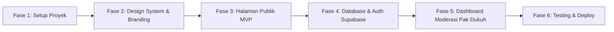

# Panduan Eksekusi Step-by-Step Pembuatan Website Potensi Padukuhan Wonosari
> **Lead Developer:** Raihan Fadhlurrahman  
> **Tim:** KKN UII Angkatan 73 Unit 57  
> **Target:** Website Profil & Potensi Padukuhan Wonosari (Rejosari, Wonosari, Pajangan)

---

## 🗺️ Roadmap Pembangunan (6 Fase Utama)



---

### 🚀 FASE 1: Setup Proyek & Lingkungan Pengembangan (Hari Ini)
* **Tujuan:** Menyiapkan kerangka kerja Next.js / React, Tailwind CSS, Lucide Icons, dan Framer Motion.
* **Langkah:**
  1. Cek instalasi Node.js dan NPM di sistem.
  2. Inisialisasi proyek Next.js (TypeScript, Tailwind CSS, App Router, ESLint).
  3. Pasang dependensi esensial:
     ```bash
     npm install framer-motion lucide-react clsx tailwind-merge canvas-confetti sonner
     ```
  4. Pengujian jalankan dev server (`npm run dev`) di `http://localhost:3000`.

---

### 🎨 FASE 2: Desain Sistem & Variabel Warna Branding
* **Tujuan:** Mengunci palet warna resmi dari `logounit_Warna.PNG` dan tipografi editorial.
* **Langkah:**
  1. Masukkan aset logo ke folder `public/images/`:
     * `logoSleman.png`
     * `logounit_Warna.PNG`
     * `logounit_Putih.PNG`
  2. Konfigurasi `tailwind.config.ts` / CSS Tokens:
     * Primary Coral: `#EF6C85`
     * Secondary Sage: `#9DB368`
     * Warm Cream: `#FAF6F0`
     * Forest Dark: `#1E251E`
  3. Konfigurasi Google Fonts (*Plus Jakarta Sans* / *Outfit* dan serif editorial).

---

### 🌐 FASE 3: Pembuatan Halaman Utama Publik (Frontend Core)
* **Tujuan:** Membangun seluruh antarmuka publik yang memukau dan interaktif.
* **Komponen yang Dibuat:**
  1. **Preloader Layar Sambutan:** Animasi logo Unit 57, progress bar 0-100%, dan nama Raihan Fadhlurrahman.
  2. **Navbar Header Sticky:** Logo Sleman + Logo KKN Unit 57 + link navigasi cepat.
  3. **Hero Section Immersive:** Judul besar Padukuhan Wonosari, video/gambar latar, selector 3 Dusun (Rejosari RW 18, Wonosari RW 17, Pajangan RW 16).
  4. **Counter Statistik Interaktif:** Jumlah Jiwa, KK, RT/RW, dan Lahan Pertanian.
  5. **Dusun Showcase Carousel:** Kartu eksplorasi tiap dusun.
  6. **Katalog UMKM & Beli via WhatsApp:** Grid produk dengan filter pill tabs & link langsung ke chat WA pemilik usaha.
  7. **Wisata & Budaya:** Highlight tradisi Merti Dusun, Nyadran, dan keasrian sawah.
  8. **Widget Interaktif Kalkulator Stunting:** Form kalkulasi Z-Score WHO sederhana + rekomendasi Posyandu.
  9. **Footer Editorial KKN UII 73:** Menampilkan atribusi *"Designed & Developed by Raihan Fadhlurrahman | KKN UII 73 Unit 57"*.

---

### 🗄️ FASE 4: Setup Backend Database & Auth (Supabase)
* **Tujuan:** Menghubungkan website dengan database cloud gratis dan teruji (Supabase).
* **Langkah:**
  1. Buat project baru di [supabase.com](https://supabase.com).
  2. Eksekusi file SQL DDL dari `MVP_SPESIFIKASI_SISTEM_DAN_ARSITEKTUR.md` di Supabase SQL Editor:
     * Tabel `users`, `artikel`, `umkm`, `destinasi_wisata`, `stunting_records`, `aparatur_desa`, `monografi_statistik`.
  3. Pasang Supabase Client di proyek:
     ```bash
     npm install @supabase/supabase-js
     ```
  4. Atur Storage Bucket `media-padukuhan` untuk upload foto produk UMKM & artikel.

---

### 🛡️ FASE 5: Sistem Moderasi & Dashboard Pak Dukuh
* **Tujuan:** Merealisasikan alur moderasi dua pintu.
* **Langkah:**
  1. **Halaman Login & Register Warga (`/login`, `/register`)**:
     * Warga bisa daftar untuk mengirim draf produk UMKM atau artikel warta desa.
  2. **Form Usulan Warga (`/tambah-umkm`, `/tulis-artikel`)**:
     * Konten yang di-submit warga otomatis tersimpan dengan status `PENDING`.
  3. **Dashboard Admin Pak Dukuh (`/admin`)**:
     * Halaman khusus login Dukuh / Pengurus.
     * Tab antrean persetujuan konten: Tombol **Approve** (langsung tayang) dan **Reject** (alasan penolakan).
     * Edit data SOTK Pengurus dan Monografi Padukuhan.

---

### 🚀 FASE 6: Testing, Optimasi & Publikasi (Deploy)
* **Tujuan:** Peluncuran website ke publik dengan alamat domain resmi/gratis.
* **Langkah:**
  1. Audit responsivitas mobile (HP Android/iPhone) & desktop.
  2. Deploy ke Vercel (gratis & terintegrasi Next.js):
     * Hubungkan repositori GitHub ke Vercel.
     * Masukkan environment variable Supabase.
  3. Domain custom (misal: `padukuhanwonosari.id` atau `.vercel.app`).
  4. Serah terima resmi ke Pak Dukuh dan Perangkat Padukuhan Wonosari.

---

## 🎯 Siap Memulai Langkah 1 Sekarang?
Kita bisa langsung mulai mengeksekusi **FASE 1 (Inisialisasi Project)** sekarang juga di folder ini!
