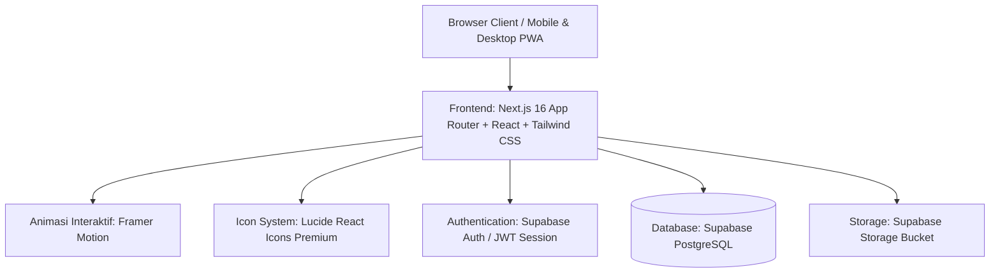
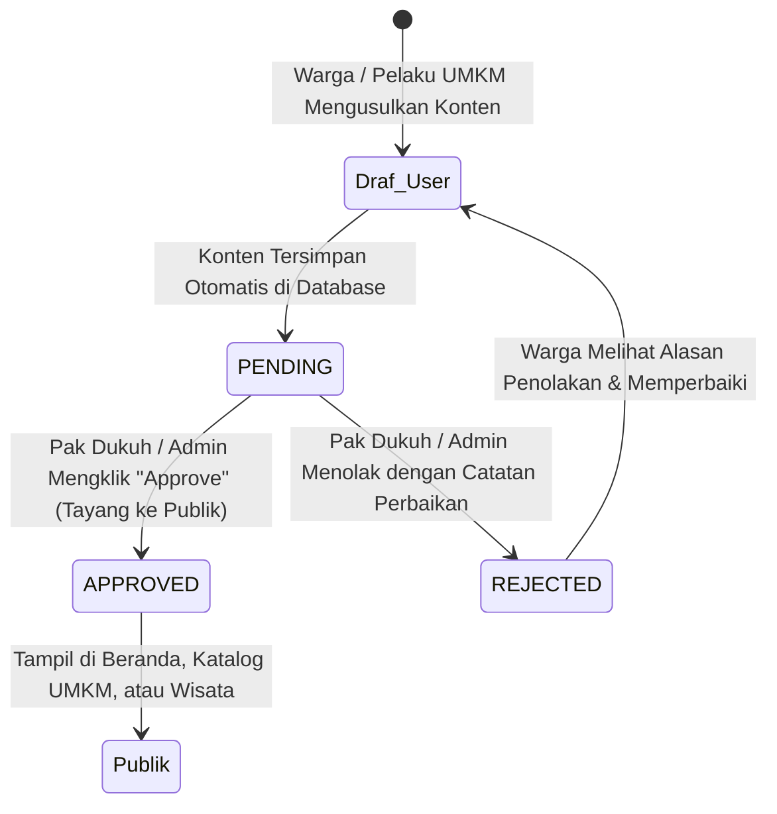

# Blueprint Spesifikasi Sistem, Arsitektur Database & Panduan Data Padukuhan Wonosari
> **Lead Developer / Pengembang Utama:** Raihan Fadhlurrahman  
> **Tim Pengembang:** KKN UII Angkatan 73 Unit 57  
> **Wilayah Fokus:** Padukuhan Wonosari (Kampung Rejosari RW 18, Kampung Wonosari RW 17, Kampung Pajangan RW 16), Kalurahan Wedomartani, Kapanewon Ngemplak, Kabupaten Sleman, D.I. Yogyakarta.  
> **Status Dokumen:** *Production-Ready MVP Specification & Complete Database Architecture*

---

## 🎨 1. Palette Warna & Branding Visual (`logounit_Warna.PNG`)

Sistem menerapkan identitas visual yang diekstraksi secara presisi dari identitas Padukuhan dan Logo Resmi Unit 57:

| Peran Warna | Kode HEX | Deskripsi & Penggunaan UI |
| :--- | :--- | :--- |
| **Primary Accent** | `#EF6C85` / `#F07389` | **Coral Rose / Salmon Pink** — Tombol aksi utama (CTA), counter statistik angka, badge highlight, hover aktif, dan aksen navigasi. |
| **Secondary Accent**| `#9DB368` / `#8B9E5A` | **Sage / Olive Green** — Melambangkan kesuburan pertanian sawah, badge kategori ramah lingkungan, icon ornamen, dan border keasrian. |
| **Soft Background** | `#FAF6F0` / `#FFFDF9` | **Warm Soft Cream** — Latar belakang visual agar nyaman di mata (*anti-glare*) dan elegan. |
| **Dark Contrast** | `#1E251E` / `#2B332B` | **Forest Dark Charcoal** — Tipografi utama, footer header, dan kontras kartu editorial. |
| **Brand Identity** | Logo Resmi | Menampilkan `logoSleman.png`, `logounit_Warna.PNG`, dan `logounit_Putih.PNG`. |

---

## 🛠️ 2. Arsitektur & Perangkat Lunak (Tech Stack)

* **Frontend:** Next.js 16 (Turbopack, App Router, TypeScript, React 19)
* **Styling & Design System:** Tailwind CSS v4 + Vanilla Custom Design Tokens
* **Animasi UI:** Framer Motion (Scroll reveal, particle background, 3D card tilt, spring counters)
* **Iconography:** Lucide React Icons (Bebas dari emoji mentah, representasi visual standar industri)
* **Backend:** Next.js Server Actions / API Handlers
* **Database & Auth:** PostgreSQL (Supabase DB) dengan skema 16 tabel terpadu & Row Level Security (RLS)
* **Storage:** Bucket penyimpanan media publik untuk foto produk UMKM, destinasi, artikel, dan foto aparatur.

---

## 🔑 3. Matriks Hak Akses & Sistem Moderasi (RBAC)

Website ini menerapkan sistem **Moderasi Dua Pintu (Approval Workflow)** untuk menjamin keamanan dan akurasi informasi publik padukuhan:

### Matriks Peran Pengguna (Role Matrix):

| Fitur / Modul | Publik (Tanpa Login) | Warga Terdaftar (Login) | Pak Dukuh / Pamong (Admin) |
| :--- | :---: | :---: | :---: |
| **Melihat Seluruh Informasi Publik** | ✅ Ya (Hanya `APPROVED`) | ✅ Ya (Hanya `APPROVED`) | ✅ Ya (Semua Status) |
| **Menjalankan Kalkulator Skrining Stunting** | ✅ Ya (Interaktif) | ✅ Ya | ✅ Ya (Bisa Ekspor Rekap) |
| **Order Produk UMKM Direct ke WhatsApp** | ✅ Ya (Click-to-Chat) | ✅ Ya | ✅ Ya |
| **Mengusulkan Produk UMKM Baru** | ❌ Wajib Login | 📝 Ya (Status: `PENDING`) | 🚀 Ya (Langsung `APPROVED`) |
| **Mengusulkan Destinasi Wisata / Event** | ❌ Wajib Login | 📝 Ya (Status: `PENDING`) | 🚀 Ya (Langsung `APPROVED`) |
| **Mengirim Berita / Artikel Warga** | ❌ Wajib Login | 📝 Ya (Status: `PENDING`) | 🚀 Ya (Langsung `APPROVED`) |
| **Persetujuan Moderasi (Approve / Reject)** | ❌ Tidak | ❌ Tidak | ✅ **AKSES PENUH** |
| **Edit Profil, Visi-Misi, Sejarah Desa** | ❌ Tidak | ❌ Tidak | ✅ **AKSES PENUH** |
| **Edit Data Aparatur, SOTK & Kontak Balai** | ❌ Tidak | ❌ Tidak | ✅ **AKSES PENUH** |
| **Ubah Data Monografi, Demografi & RW/RT** | ❌ Tidak | ❌ Tidak | ✅ **AKSES PENUH** |
| **Update Jadwal Posyandu & Banner Pengumuman**| ❌ Tidak | ❌ Tidak | ✅ **AKSES PENUH** |

---

## 🗄️ 4. Arsitektur Database Terpadu (16 Tabel Lengkap)

Skema database lengkap yang siap dieksekusi di Supabase / PostgreSQL telah dimuat pada file [`dokumen/schema.sql`](file:///c:/KKN%20Wedomartani/potensipadukuhanwonosari-webapp/dokumen/schema.sql).

### Ringkasan Relasi & Fungsi Tabel:

1. **`users`** — Menyimpan profil pengguna, nomor WhatsApp, domisili RW/RT, dan peran terpadu (3 peran: `padukuh` untuk Kepala Dukuh/validasi konten, `admin` untuk Administrator Web/KKN, dan `kontributor` untuk Warga/Karang Taruna yang mengunggah artikel & foto kegiatan).
2. **`profil_padukuhan`** — Menyimpan narasi visi, misi (JSON array), sejarah Padukuhan, sejarah detail per kampung (Rejosari, Wonosari, Pajangan), serta sambutan resmi Kepala Dukuh.
3. **`pengaturan_web`** — Pengaturan dinamis kontak padukuhan: alamat fisik, tautan Google Maps iframe & direct link, koordinat GPS, nomor WhatsApp pelayanan warga, Instagram, YouTube, jam kantor, dan banner pengumuman kilat.
4. **`aparatur_desa`** — Data struktur organisasi (SOTK), foto pengurus, jabatan (Dukuh, RW 16/17/18, RT 01-05, PKK, Karang Taruna, Linmas), nomor kontak, dan urutan tampil.
5. **`demografi_wilayah`** — Data agregat kependudukan per RT & RW (Jumlah KK, Jiwa, Gender L/P, Klasifikasi Usia Balita s/d Lansia, Profesi Warga, Luas Wilayah).
6. **`sarana_prasarana`** — Inventaris fasilitas umum padukuhan (Masjid, Balai Warga, Pos Kamling, Saluran Irigasi Sawah, Bank Sampah).
7. **`artikel`** — Berita, agenda kegiatan, pengumuman, dan publikasi desa dengan status moderasi (`PENDING`, `APPROVED`, `REJECTED`).
8. **`umkm`** — Katalog produk warga lokal dengan harga, satuan, foto, dusun asal, dan nomor WhatsApp penjual untuk pemesanan langsung.
9. **`destinasi_wisata`** — Spot agrowisata, edukasi, dan budaya dengan deskripsi, tiket, fasilitas, dan sematan lokasi.
10. **`agenda_budaya`** — Jadwal event adat & kegiatan komunal (Merti Dusun, Nyadran, Kerja Bakti, Pentas Seni).
11. **`jadwal_posyandu`** — Kalender rutin layanan Posyandu balita & lansia per RW beserta penanggung jawab.
12. **`kader_kesehatan`** — Daftar kontak Bidan Desa & kader posyandu aktif yang dapat dihubungi via WhatsApp untuk konsultasi kesehatan dan rujukan stunting.
13. **`stunting_records`** — Log riwayat perhitungan kalkulator antropometri (usia, BB, TB, Z-score, status gizi balita).
14. **`galeri_desa`** — Dokumentasi foto & video album kegiatan gotong royong dan tradisi warga.

---

## 📋 5. Cheatsheet / Checklist Kebutuhan Data Lapangan

Berikut adalah rincian data nyata yang dibutuhkan dari Pak Dukuh, Ibu Kader, dan Pengurus RW/RT untuk melengkapi seluruh konten website:

### 1. Halaman Profil Desa (`/profil-desa`)
* [ ] Teks resmi Visi & Misi Padukuhan Wonosari.
* [ ] Catatan sejarah asal-usul 3 kampung: Rejosari, Wonosari, dan Pajangan.
* [ ] Foto resmi Kepala Dukuh + Kata Sambutan pembuka.
* [ ] Bagan SOTK: Daftar nama Ketua RW 16, 17, 18 dan Ketua RT 01 s/d 05.
* [ ] Foto pengurus RT/RW, Ketua PKK, dan Karang Taruna.

### 2. Halaman Monografi & Statistik (`/monografis`)
* [ ] Rekap data jumlah KK dan Jiwa (Laki-laki & Perempuan) per RT (RT 01 Pajangan, RT 02 & 03 Wonosari, RT 04 & 05 Rejosari).
* [ ] Data mata pencaharian dominan (Petani, Buruh, Karyawan, Wiraswasta, PNS).
* [ ] Data kelompok usia balita, anak sekolah, produktif, dan lansia.
* [ ] Luas perkiraan lahan persawahan, permukiman, dan fasilitas umum.

### 3. Halaman Katalog UMKM (`/umkm`)
* [ ] Daftar produk unggulan warga di Rejosari, Wonosari, dan Pajangan.
* [ ] Foto produk asli (minimal 1 foto tajam per produk).
* [ ] Nama usaha & nama pemilik.
* [ ] Kisaran harga dan satuan penjualan (misal: Rp 15.000 / bungkus).
* [ ] Nomor WhatsApp aktif pemilik produk untuk tombol direct order.

### 4. Halaman Destinasi & Kebudayaan (`/wisata`)
* [ ] Spot daya tarik alam (jalur sawah, Bank Sampah BASAH Rejosari, pendopo/balai pertemuan).
* [ ] Jadwal atau siklus tahunan tradisi Merti Dusun dan Upacara Nyadran.
* [ ] Foto dokumentasi kegiatan tradisi masa lalu / pentas seni warga.
* [ ] Titik Google Maps akurat balai padukuhan / pusat kegiatan.

### 5. Halaman Pencegahan Stunting & Posyandu (`/stunting`)
* [ ] Nama dan lokasi pos Posyandu di tiap RW (misal: Posyandu Dahlia Rejosari, Melati Wonosari, Kenanga Pajangan).
* [ ] Jadwal rutin pelaksanaan penimbangan tiap bulan.
* [ ] Nomor kontak WhatsApp Bidan Desa atau Ketua Kader Posyandu untuk rujukan konsultasi gizi.
* [ ] Menu PMT (Pemberian Makanan Tambahan) khas lokal yang sering dibagikan.

### 6. Halaman Kabar Berita & Pengumuman (`/artikel`)
* [ ] Rilis berita kegiatan warga teranyar atau liputan program KKN UII Unit 57.
* [ ] Pengumuman penting (agenda kerja bakti, penarikan PBB, jadwal ronda, dsb).

---

## 🚀 6. Langkah Implementasi Database Selanjutnya

1. **Jalankan Skrip SQL:** Buka dashboard Supabase / PostgreSQL, buka menu **SQL Editor**, dan tempel seluruh isi file [`dokumen/schema.sql`](file:///c:/KKN%20Wedomartani/potensipadukuhanwonosari-webapp/dokumen/schema.sql).
2. **Koneksi Environment:** Hubungkan `NEXT_PUBLIC_SUPABASE_URL` dan `NEXT_PUBLIC_SUPABASE_ANON_KEY` ke `.env.local`.
3. **Penyusunan Form Admin:** Halaman `/admin` dapat langsung melakukan CRUD terhadap 16 tabel yang sudah dilengkapi RLS dan trigger otomatis.
